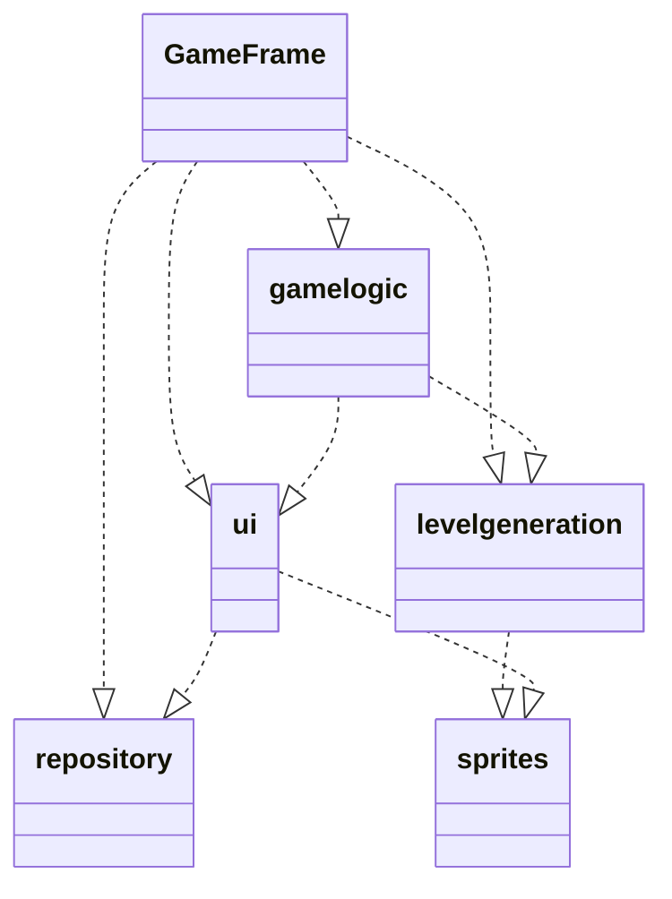
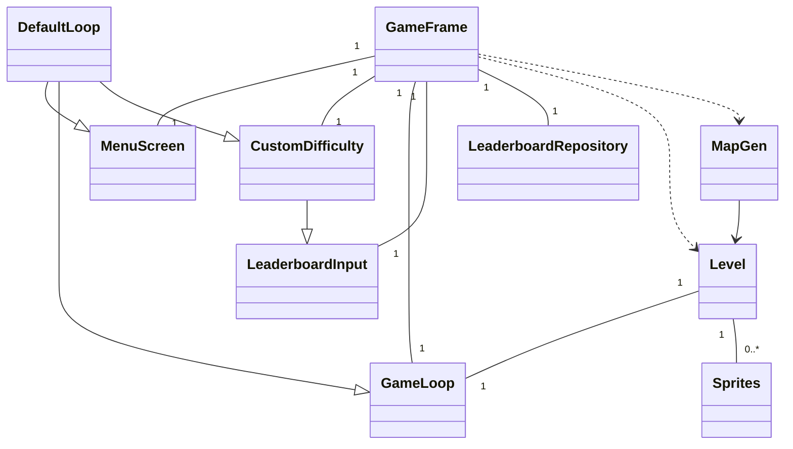
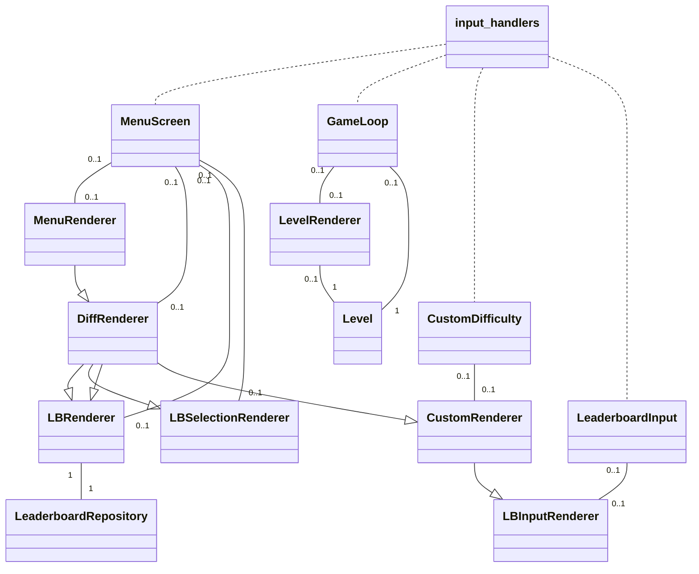
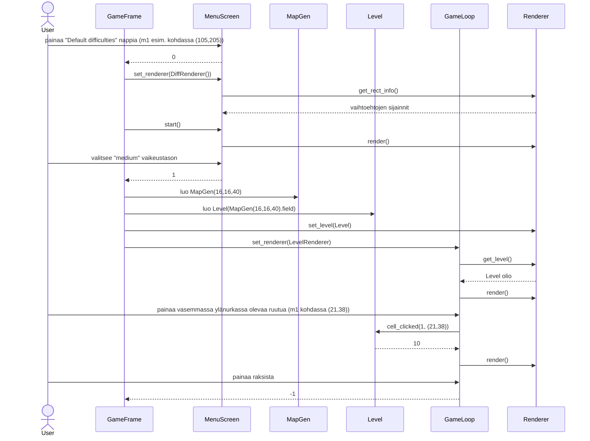
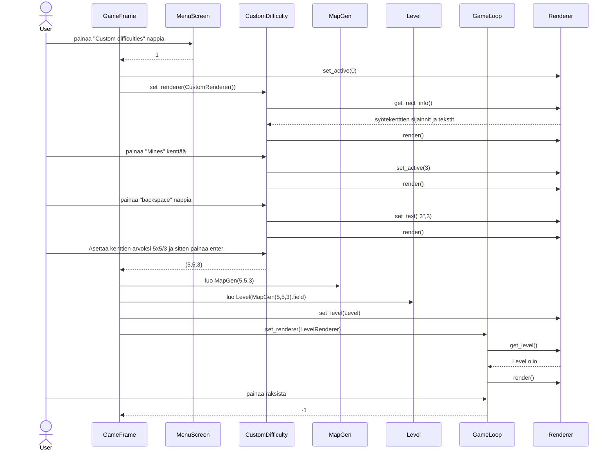
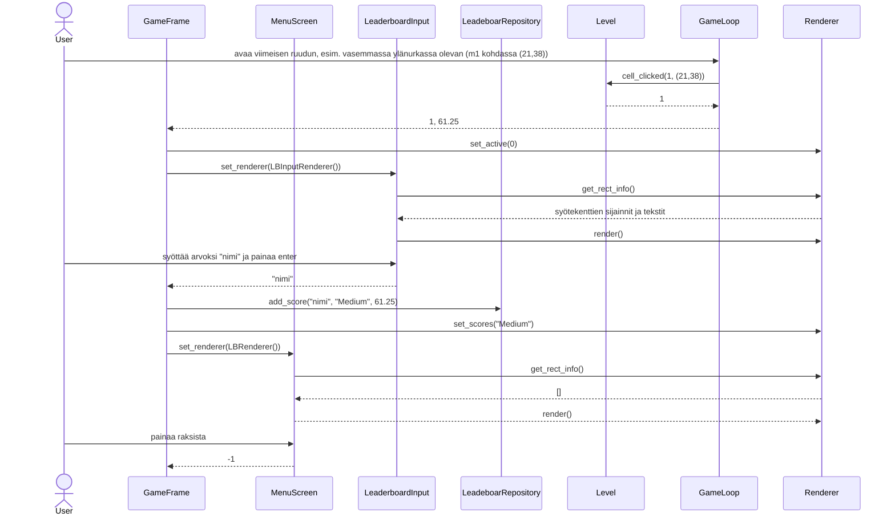

# Arkkitehtuurikuvaus

## Rakenne

Tässä on yleiskuva sovelluksen rakenteesta, missä GameFrame on (src/main.py) tiedoston ainoa Luokka

GameFrame on Luokka, joka vastaa muiden luokkien välillä siirtymisestä. 

*gamelogic* sisältää käyttäjän syötteitä lukevan koodin. 

*ui* sisältää rendererit eli näkymien ulkonäöstä ja piirtämisestä vastaavat luokat. 

*levelgeneration* sisältää pelikentän spritejen luomisesta ja poistamisesta vastaavan koodin. 

*sprites* sisältää kaikki sovelluksen käyttämät pygame.sprite luokat. 

Viimeiseksi *repository* vastaa tietokannan lukemisesta ja siihen kirjoittamisesta

## Sovelluslogiikka

Sovelluksen yksinkertaistettu (Clock ja EventQueue sekä rendererit jätetty pois) luokkakaavio näyttää vastaavalta:

Pois jätetyt Luokat sopivat palapeliin, siten että jokaiselle input_handlerille (**MenuScreen, CustomDifficulty, GameLoop ja LeaderboardInput**) luovutetaan sen luonnissa yksi **Clock** ja yksi **EventQueue** olio. Jokaisessa näkymän siirtymässä taas **GameFrame()** asettaa input_handlereille uuden rendererin.

Logiikan kannalta tärkein luokista on **GameFrame()**, joka on nimensä mukaisesti eräänlainen runko sovellukselle. Se on ensimmäinen luokka, joka luodaan ja se on se jonka kautta poistutaan. GameFramen ainoa tehtävä on muiden luokkien välillä siirtyminen. GameFramen `menu()` metodi kutsutaan käynnistämisen yhteydessä ja siitä voidaan siirtyä muihin metodeihin. Kaikki GameFramen muut metodit taas ovat vastuussa jostakin näkymän siirtymästä

- `enter_start_menu()` - Aloitusnäkymä
- `selected_difficulties(selection)` - Kumpikin vaikeus valikko
- `start_game_loop(grid_x, grid_y, mines)` - Pelikenttä
- `save_game_score(difficulty, time)` - Voittoruutu
- `leaderboard_selection()` - Tulostauluvalikko
- `enter_leaderboard()` - Tulostaulu

Esimerkiksi `enter_start_menu()` metodi, joka kutsutaan käynnistämisen yhteydessä. Metodi antaa MenuScreen luokalle aloitusnäkymästä vastaavan MenuRendererin `set_renderer(renderer)` metodilla ja sitten kutsuu MenuScreen:in `start()` metodia joka palauttaa käyttäjän syöttettä vastaavan numeron (esim. *-1*, kun painetaan ruksista), jonka palautetaan `menu()` metodiin, joka siirtää seuraavaan näkymään.

Jokainen input_handlers.py-tiedoston luokkien `handle_events()` metodit määrittelevät mikä syöte tai tapahtuma tekee mitäkin. Esim. kaikille luokille yhteistä on, että ruksin painamisesta johtuva pygame.QUIT tyyppinen tapahtuma tarkoittaa, että metodi palauttaa -1. 

Sovelluslogiikaksi laskisin myös MapGen ja Level luokat, joita käytetään `start_game_loop()` metodin yhteydessä. GameLoop:iin siirtyessä täytyy muodostaa myös kartta, joten metodin alussa muodostetaan **MapGen(x,y,mines)** olio ja sen pohjalta **Level(MapGen)** olio. MapGen osuus tässä on kartan luominen numeroesitteenä, jonka pohjalta sitten Level luo Spritet. Level sitten annetaan ensin **LevelRenderer()** rendererille joka vuorostaan asetetaan `set_renderer(renderer)` metodilla **GameLoop()** luokalle. **Level()** olio siis hiiren nappien painalluksein pohjalta luo ja poistaa omia Spritejä, kun hiiren painallukset lukee **GameLoop()** ja Spritet piirtää **LevelRenderer()**.

Näkymän vaihtamisen lisäksi `save_game_score(difficulty, time)` metodi ensin lukee käyttäjältä syötteen **LeaderboardInput()** luokalla ja sitten myös tallentaa sen tietokantaan **LeaderboardRepository()** luokan olion kautta.

## Käyttöliittymä

Käyttöliittymässä on yhteensä seitsemän eri näkymää *(rendereri)/(input_handleri)*:

- Alkunäkymä *(MenuRenderer)/(MenuScreen)
- Valmiiksi aseteltu vaikeustaso valikko *(DiffRenderer)/(MenuScreen)
- Vaikeuden säätö ruutu *(CustomRenderer)/(CustomDifficulty)
- Varsinainen pelikenttä *(LevelRenderer)/(GameLoop)
- Voittoruutu johon syötetään käyttäjänimi *(LBInputRenderer)/(LeaderboardInput)
- Tulostaulun valikko *(LBSelectionRenderer)/(MenuScreen)
- Itse tulostaulu *(LBRenderer)/(MenuScreen)

Selvennyksenä kuitenkin vielä rendereiden yhteydet sovelluslogiikan luokkakaavioon:

Näiden näkymien piirtämisestä vastaa (src/ui) kasio tai tarkemmin (src/ui/renderers.py) tiedosto. Siellä jokaiselle näkymälle on sitä vastaava luokka. Näitä rendereitä, sitten käyttävät (src/gamelogic/input_handlers.py) tiedoston luokat. Nämä luokat vastaavat käyttäjän syötteiden lukemisesta ja rendereiden kanssa näkymien toiminnasta. Kuitenkaan input_handlerit ja rendererit eivät mene yksi yhteen, vaan esim. alkunäkymä ja tulostaulun valikon erittäin samankaltaisen toiminnallisuuden hoitaa sama MenuScreen Luokka. Neljässä näistä rendereiden tehtävänä on ainoastaan get_rect_info() metodilla antaa input_handlerille valikon kentät ja input_handleri sitten kutsuu render() metodia, kun kuva tarvitsee piirtää. 

Poikkeuksena tähän ovat vaikeuden säätö ja voittoruutu sekä pelikenttä. Ensimmäistä kahta vastaavissa rendereissä (CustomRenderer ja LBInputRenderer) on metodit set_active(which) ja set_text(text, which) joita input_handleri kutsuu ja jotka vain vaikuttavat syötekenttien piirtämiseen. Pelikentässä mukana on vielä Level luokka (src/gamelogic/level.py). Pelin input_handleri kutsuu sen metodia cell_clicked(button, pos), jonka pohjalta Level muokkaa omia Sprite olioita. LevelRenderer sitten vain piirtää kaikki levelin Spritet.

## Tietojen pysyväistallennus

Pakkauksen _repository_ luokka `LeaderboardRepository` huolehtii tietojen tallentamisesta ja lukemisesta. Luokka noudattaa [Repository](https://en.wikipedia.org/wiki/Data_access_object) -suunnittelumallia. Luokka toteuttaa vain kaksi metodia add_score(name, difficulty, time) ja get_scores(difficulty) ja sen voikin korvata nämä toteuttavalla vastineella.

### Tiedostot

Sovelluksen juureen sijoitettu konfiguraatiotiedosto .env  määrittelee tiedostojen nimet. 

Näihin kuuluu SQLite-tietokanta, jonka tauluun `Score`, joka alustetaan initialize_database.py-tiedostossa, tallennetaan pelien tulokset. 
Lisäksi myös kaikki .png assetit (src/assets) määritellään .env tiedostossa. Näiden muuttamisessa, uuden kuvatiedoston resoluution tulee olla sama tai muuten saattaa peli hajota.

## Päätoiminnallisuudet

Sekvenssikaavioita sovelluksen toiminnallisuudesta, näissä en perehdy 

### Pelin pelaamista

Sovellus on jo käynnistetty `Poetry run invoke start` komennolla, valitaan valmiiksi asetetuista vaikeuksista keskivaikea, avataan yksi ruutu (joka sattumoisin ei ole miina) ja poistutaan pelistä.
(selvyyden vuoksi Clock, Eventqueue, spritet jätetty pois ja rendererit yhdistetty)

Alussa ollaan siis MenuScreenillä lukemassa syötteitä ja MenuRendererillä piirtämässä alkunäkymää. Vaikeusvalikkoon siirrytään muuttamalla rendereriä `set_renderer(DiffRenderer)`, mutta pysytään vielä MenuScreen input_handlerilla. Tässä välissä get_rect_info() DiffRendererillä palauttaa listan vaihtoehdoista pygame.Rect() olioina, esim Pygame.Rect(100,200,550,75). Peliin siirtymistä varten luodaan MapGen(), jonka kentän pohjalta luodaan Level(), joka annetaan LevelRendererille, joka annetaan GameLoopille ja jolta GameLoop kysyy Levelin itselleen.

### "Custom Difficulties" näkymän toimintaa

Siirrytään alkunäkymästä "Custom Difficulty":n ja asetetaan kenttien arvoksi "Width":5, "Height":5, "Mines":3, käynnistetään peli painamalla enteriä ja poistutaan ruksista saman tien.

Näkymän toiminnasta tarkemmin: get_rect_info() palauttaa nyt listan listoja muodossa esim. ["16", False, pygame.Rect()] backspace poistaa oikeimmaisen kirjaimen ja mikä tahansa numeronäppäin lisää numeron. Jos lisäyksen jälkeen raja ylittyy (rajat ovat 38, 18, 684) päivitetään set_text(raja). Myöskin poistuessa GameFrameen tarkistetaan, että kaikki >1 ja miinoja <= leveys x korkeus ja säädetään tarvittaessa.

### Voittoruudun ja tietokanta toimintaa

Ollaan päästy peliin ensimmäisen esimerkin mukaisesti ja pelattiin peli loppuun asti, pelissä kesti 61.25s. Voittoruudussa nimeksi syötetään "nimi" ja painettiin enteriä. Päästyään tulostauluun postutaan ruksista

LeaderboardInput toimii siis lähes samalla tavalla kuin CustomDifficulty. Erona ainoastaan, että hyväksytään kaikki unicode merkit ja rajana on nimen pituus joka on max kahdeksan merkkiä. GameLoop palautttaa siis kuluneen ajan ja vaikeustaso on koko ajan tallessa GameFramella. Yhdessä LeaderboardInput nimi, GameLoop aika ja GameFrame tallennetaan tietokantaan. Tietokannasta tulostauluun haetaan vain vaikeustason pohjalta. Tulostaulu toimii siis myös MenuScreenillä, mutta siinä ei ole yhtään vaihtoehtokenttää. Ainoat toiminnallisuudet ovat siis ruksi (-1) ja ESC (5).

### Muut toiminnallisuudet

Jokaiselle näkymälle on oma Rendereri, joka vastaa näkymän ulkonäöstä. Suurin osa näkymistä toimii MenuScreen input_handlerin kautta, koska se hoitaa valikot joissa on vain vaihtoehtokenttiä (lkm 0-4) joita voi hiiren napilla painaa. Muut Rendererit vastaavat kaikki vain yhden erikoisemman näkymän toiminnasta. 

Kaikissa näkymissä voi kuitenkin poistua sovelluksesta ruksilla ja useimmissa voi palata edelliseen näkymään ESCillä. Vain alkunäkymä ja itse pelinäkymä eivät tätä salli. 

## Ohjelman rakenteeseen jääneet heikkoudet

### Jaottelu

Vähän hankaloittaa lukevuutta kun on näin monta luokkaa näin vähäisissä tiedostoissa ja näin monessa eri kansiossa. Ehkä olisi voinut rakennetta vielä työstää

### input_handlerit

En tiedä laskettaisiinko sovelluslogiikaksi, mutta input_handlerit, joiden on tarkoitus olla käyttöliittymää, sisältävät koodin havaitsemaan mitä vaihtoehtoa on klikattu. CustomDifficultyn sekä LeaderboardInputin tapauksisssa sisältyy myös koodia rendererin tekstien muuttamiseen. Mielestäni nämä on vielä tarpeeksi lähellä käyttöliittymää ja tarpeeksi pieniä toiminnallisuuksia, mutta ne olisi voinut periaatteessa eristää silti.
