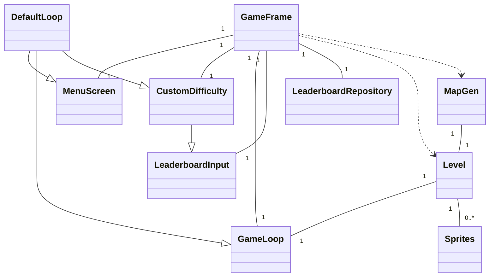
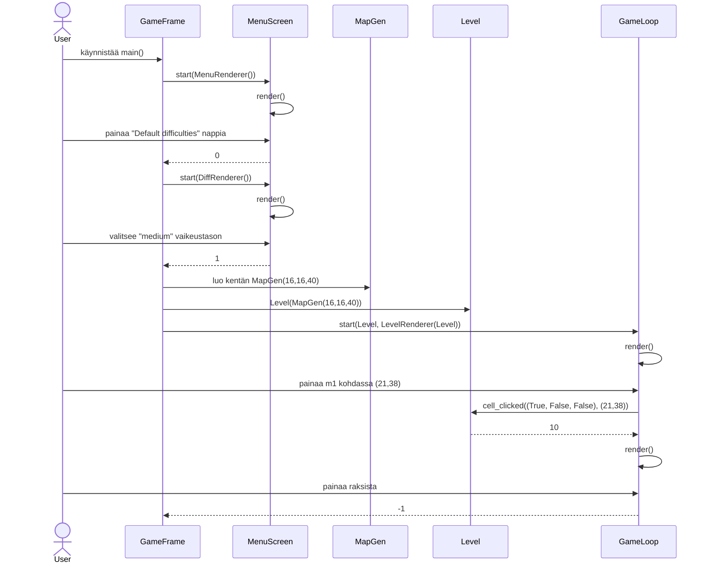

# Arkkitehtuurikuvaus

## Rakenne

-tba

## Käyttöliittymä

Käyttöliittymässä on yhteensä seitsemän eri näkymää:

- Alkunäkymä
- Valmiiksi aseteltu vaikeustaso valikko
- Vaikeuden säätö ruutu
- Varsinainen pelikenttä
- Voittoruutu johon syötetään käyttäjänimi
- Tulostaulun valikko
- Itse tulostaulu

Näiden näkymien piirtämisestä vastaa src/ui kansio. Siellä jokaiselle näkymälle on sitä vastaava tiedosto ja siellä luokka. Näitä rendereitä, sitten käyttävät src/gamelogic/input_handlers.py tiedoston luokat. Nämä luokat vastaavat käyttäjän syötteiden lukemisesta ja rendereiden kanssa näkymien toiminnasta. Kuitenkaan input_handlerit ja rendererit eivät mene yksi yhteen, vaan esim. alkunäkymä ja tulostaulun valikon erittäin samankaltaisen toiminnallisuuden hoitaa sama MenuScreen Luokka. Neljässä näistä rendereiden tehtävänä on ainoastaan get_rect_info() metodilla antaa input_handlerille valikon kentät ja input_handleri sitten kutsuu render() metodia, kun kuva tarvitsee piirtää. 

Poikkeuksena tähän ovat vaikeuden säätö ja voittoruutu sekä pelikenttä. Ensimmäistä kahta vastaavissa rendereissä (CustomRenderer ja LBInputRenderer) on metodit set_active(which) ja set_text(text, which) joita input_handleri kutsuu ja jotka vain vaikuttavat tekstikenttien piirtämiseen. Pelikentässä mukana on vielä Level luokka (src/gamelogic/level.py). Pelin input_handleri kutsuu sen metodia cell_clicked(button, pos), jonka pohjalta Level muokkaa omia Sprite olioita. LevelRenderer sitten vain piirtää kaikki levelin Spritet.

## Sovelluslogiikka

Sovelluksen yksinkertaistettu (Clock ja EventQueue sekä rendererit jätetty pois) luokkakaavio näyttää vastaavalta

Pois jätetyt Luokat sopivat palapeliin, siten että GameFramen luonnissa se luovuttaa jokaiselle input_handlerille (MenuScreen, CustomDifficulty, GameLoop ja LeaderboardInput) yhden Clock ja yhden EventQueue olion. Jokaisessa siirtymässä taas GameFrame luovuttaa input_handlereille uuden rendererin. Yhteisenä tekijänä kuitenkin mikään näistä ei ole vuorovaikutuksessa kuin niistä vastaavan input_handlerin kanssa.

Logiikan kannalta tärkein luokista on GameFrame, joka on nimensä mukaisesti eräänlainen runko sovellukselle. Se on ensimmäinen luokka, joka luodaan ja se on se jonka kautta poistutaan. GameFramen ainoa tehtävä on muiden luokkien välillä siirtyminen. GameFramen menu() metodi kutsutaan käynnistämisen yhteydessä ja siitä voidaan siirtyä muihin metodeihin. Kaikki GameFramen muut metodit taas ovat vastuussa jostakin näkymän siirtymästä

- `enter_start_menu()` Aloitusnäkymä
- `selected_difficulties(selection)` Kumpikin vaikeus valikko
- `start_game_loop(grid_x, grid_y, mines)` Pelikenttä
- `save_game_score(difficulty, time)` Voittoruutu
- `enter_leaderboard()` Tulostaulu, sitä edeltävän valikon jälkeen

Esimerkiksi enter_start_menu() metodi, joka kutsutaan käynnistämisen yhteydessä ja sekä kutsuu aloitusnäkymästä vastaavaa MenuScreen:in start() metodia, ja käyttäjän syötteen jälkeen siirtää seuraavaan näkymään. enter_start_menu sitten palauttaa näkymän lopettamaa syötettä vastaavan kokonaisluvun (esim. -1, kun painetaan ruksista).

Jokainen input_handlers.py-tiedoston luokista vastaa oman näkymänsä toiminnasta ja sen luokkien handle_events() metodit määrittelevät mikä syöte tai tapahtuma tekee mitäkin. Esim. kaikille luokille yhteistä on, että ruksin painamisesta johtuva pygame.QUIT tyyppinen tapahtuma tarkoittaa, että metodi palauttaa -1.

`start_game_loop()` ja `save_game_score(difficulty, time)` metodeille on lisätoimintaa näkymän siirtymisen lisäksi. GameLoop:iin siirtyessä täytyy muodostaa myös kartta, joten metodin alussa muodostetaan MapGen(x,y,mines) olio ja sen pohjalta Level(MapGen) olio, jonka pohjalta käynnistetään GameLoop. Jälkimmäinen metodi taas ensin lukee käyttäjältä syötteen LeaderboardInput luokalla ja sitten myös tallentaa sen tietokantaan LeaderboardRepository luokan olion kautta.

## Tietojen pysyväistallennus

Pakkauksen _repository_ luokka `LeaderboardRepository` huolehtii tietojen tallentamisesta ja lukemisesta. Luokka noudattaa [Repository](https://en.wikipedia.org/wiki/Data_access_object) -suunnittelumallia. Luokka toteuttaa vain kaksi metodia add_score(name, difficulty, time) ja get_scores(difficulty) ja sen voikin korvata nämä toteuttavalla vastineella.

### Tiedostot

Sovelluksen juureen sijoitettu konfiguraatiotiedosto .env  määrittelee tiedostojen nimet. 

Näihin kuuluu SQLite-tietokanta, jonka tauluun `Score`, joka alustetaan initialize_database.py-tiedostossa, tallennetaan pelien tulokset. 
Lisäksi myös kaikki .png assetit (src/assets) määritellään .env tiedostossa. Näiden muuttamisessa, uuden kuvatiedoston resoluution tulee olla sama tai muuten saattaa peli hajota.

## Päätoiminnallisuudet

(Alkuun vain yksi) Sekvenssikaavioita sovelluksen toiminnallisuudesta

### Pelin aloitus

Sovellus käynnistetään sen jälkeen kun GameFrame on luotu, valitaan valmiiksi asetetuista vaikeuksista keskivaikea, avataan yksi ruutu ja poistutaan pelistä.
(selvyyden vuoksi Clock, Eventqueue, spritet sekä rendererit jätetty pois)

### Muut toiminnallisuudet

Yleiskuvana siis GameFrame siirtyy näkymien välillä, joissa input_handlerit vastaavat näkymän toiminnallisuudesta ja rendererit näkymän ulkonäöstä. 

## Ohjelman rakenteeseen jääneet heikkoudet

### Rendererit

Tällä hetkellä rendererit ovat sotkuisia ja hajaannettuja. Varmaan parasta olisi yhdistää ne samalla tavalla kuin input_handler.py tiedostossa, eli yksi luokka josta muut perivät suurimman osan toiminnallisuuksista.

### Luokkajako

Hetkellä nimet ovat vähän sekavia, etenkin input_handler luokilla. Sovelluksen alkuvaiheissa tilanne oli siedettävä, mutta nyt luokkia on paljon enemmän. Saatan koettaa yhdistää kaikki yhdeksi samaksi luokaksi jolla eri metodit hoitaa eri toiminnallisuuksia.
