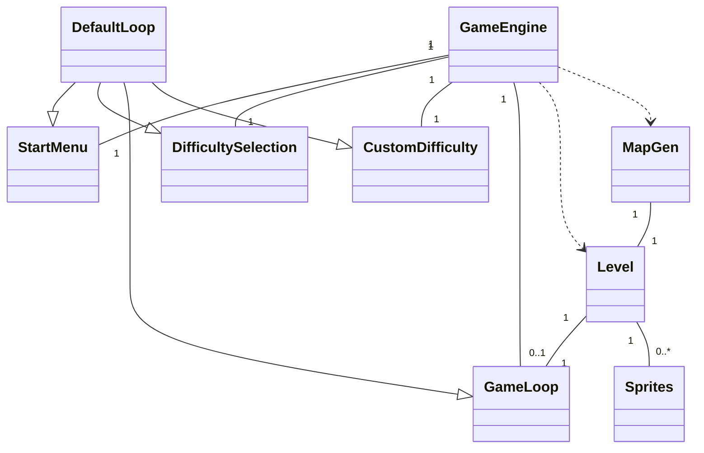
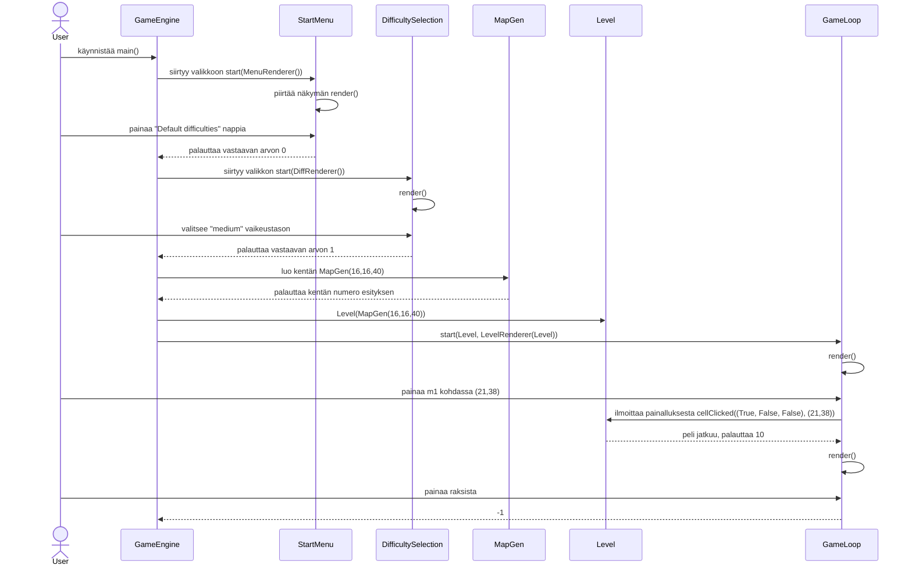

Clock ja EventQueue sekä tietenkin UI jätetty pois

Sovellus käynnistetään sen jälkeen kun GameEngine on luotu, valitaan valmiiksi asetetuista vaikeuksista keskivaikea, avataan ruutu ja poistutaan pelistä.
(selvyyden vuoksi Clock, Eventqueue, spritet sekä rendererit jätetty pois)

