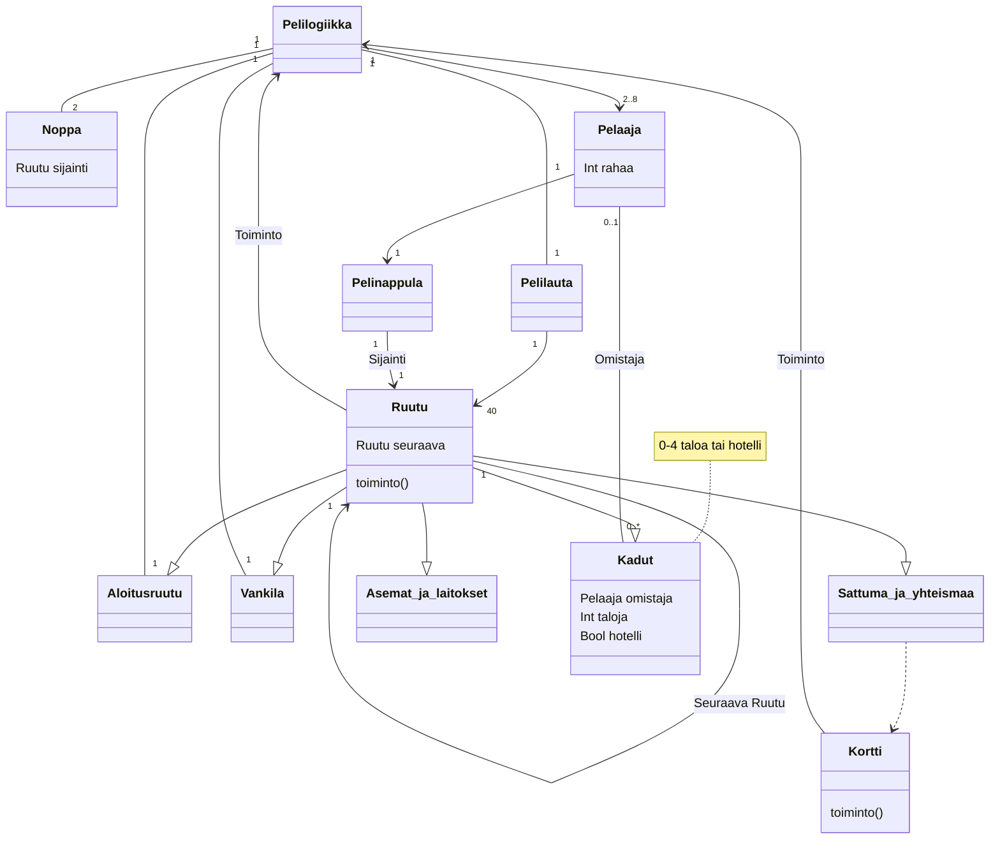

```mermaid
 classDiagram
      Pelilogiikka "1" -- "2" Noppa
      Pelilogiikka "1" --> "2..8" Pelaaja
      Pelaaja "1" --> "1" Pelinappula
      Pelilogiikka "1" -- "1" Pelilauta
      Pelilauta "1" --> "40" Ruutu
      Pelinappula "1" --> "1" Ruutu : Sijainti
      Ruutu "1" --> "1" Ruutu : Seuraava Ruutu
      Ruutu --|> Aloitusruutu
      Ruutu --|> Vankila
      Ruutu --|> Sattuma_ja_yhteismaa
      Ruutu --|> Asemat_ja_laitokset
      Ruutu --|> Kadut
      Kadut "0..*" -- "0..1" Pelaaja : Omistaja
      Pelilogiikka "1" -- "1" Aloitusruutu
      Pelilogiikka "1" -- "1" Vankila
      note for Kadut "0-4 taloa tai hotelli"
      Sattuma_ja_yhteismaa ..> Kortti 
      Ruutu --> Pelilogiikka : Toiminto
      Kortti --> Pelilogiikka : Toiminto
      class Aloitusruutu{
      }
      class Vankila{
      }
      class Sattuma_ja_yhteismaa{
      }
      class Asemat_ja_laitokset{
      }
      class Kadut{
          Pelaaja omistaja
          Int taloja
          Bool hotelli
      }
      class Pelilogiikka{
      }
      class Pelilauta{
      }
      class Noppa{
          Ruutu sijainti
      }
      class Pelaaja{
          Int rahaa
      }
      class Ruutu{
          Ruutu seuraava
          toiminto()
      }
      class Pelinappula{
      }
      class Kortti{
          toiminto()
      }
```
